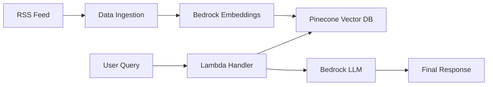

# RTE News Bot

A serverless Retrieval-Augmented Generation (RAG) system built with AWS Bedrock and Pinecone for real-time news Q&A.
The system supports both:
- Fully Cloud (Serverless) deployment
- Hybrid (Local + Cloud) deployment

It is built using AWS Lambda, EventBridge, SAM, Bedrock, and Pinecone.

---
# 🚀 Architecture Overview

The system is divided into three Lambda functions:

1. 🆕 Ingestion Lambda (**news_update.py**) (EventBridge Scheduled)
- Fetches RSS news from RTE
- Cleans and chunks articles
- Generates embeddings using AWS Bedrock (amazon.titan-embed-text-v2:0)
- Stores vectors in Pinecone
2. 🧠 Generation Lambda (**app.py**) (API Gateway Trigger)
- Accepts user queries
- Retrieves relevant news from Pinecone
- Sends context to AWS Bedrock LLM
- Returns structured JSON response
3. 🗑️ Cleanup Lambda (**delete_news.py**) (EventBridge Scheduled)
-Deletes old news vectors from Pinecone
- Keeps vector DB fresh and optimized
---
# 🔄 Deployment Modes

  # ☁️ Fully Cloud (Serverless Mode)
-All components run on AWS:
  * EventBridge → triggers ingestion & cleanup
  * API Gateway → triggers query Lambda
  Flow:
```
  EventBridge → Lambda → Pinecone → Bedrock → Response
```
  ✅ Benefits:
  - Fully automated
  - Scalable
  - Production-ready
  
---

# 🖥️ Hybrid Mode (Local + Cloud)
 - Run ingestion & delete locally using cron
 - Use AWS Lambda for query handling
 Flow:
```
  Local Cron → Pinecone → Lambda → Bedrock → Response
```
- Example cron job:
 ``` 
    0 * * * * python lambdas/news_update.py
```
  ✅ Benefits:
   - Easier local testing
   - Faster development
   - No EventBridge setup needed
    
  ---
# ✨ Features
- Live RSS News Ingestion (RTE)
- Semantic Search using Pinecone
- Context-aware LLM responses via AWS Bedrock
- Chat memory support
- Automated cleanup with scheduling
- Fully serverless architecture

---
# 🧠 System Flow

---
# 🛠️ Tech Stack
* AWS Lambda
* AWS Bedrock (Titan Embeddings + LLM)
* Pinecone Vector Database
* EventBridge (Scheduled Jobs)
* Python 3.10
* feedparser
---
# 📁 Project Structure
```
Rte-News-Bot/
│
├── lambdas/
│   ├── app.py            # RAG chatbot handler
│   ├── news_update.py   # RSS → Pinecone ingestion
│   └── delete_news.py  # delete old vectors
│
├── template.yaml        # AWS SAM template
├── requirements.txt
├── event.json           # test event for Lambda
└── README.md
```
---
# ⚙️ AWS SAM Setup
1. Install SAM CLI
pip install aws-sam-cli
2. Build
sam build
3. Deploy
sam deploy --guided
---
# 🧾 SAM Template (EventBridge Scheduling)
```
AWSTemplateFormatVersion: '2010-09-09'
Transform: AWS::Serverless-2016-10-31
Description: RTE News RAG System

Globals:
  Function:
    Runtime: python3.10
    Timeout: 30
    MemorySize: 512

Resources:

  GenerateFunction:
    Type: AWS::Serverless::Function
    Properties:
      Handler: lambdas.app.lambda_handler
      Events:
        ApiEvent:
          Type: Api
          Properties:
            Path: /query
            Method: post

  IngestionFunction:
    Type: AWS::Serverless::Function
    Properties:
      Handler: lambdas.news_update.lambda_handler
      Events:
        IngestionSchedule:
          Type: Schedule
          Properties:
            Schedule: rate(4 hour)

  CleanupFunction:
    Type: AWS::Serverless::Function
    Properties:
      Handler: lambdas.delete_news.lambda_handler
      Events:
        CleanupSchedule:
          Type: Schedule
          Properties:
            Schedule: cron(0 3 * * ? *)
```
---
# 🔐 Environment Variables
Create a .env file:
```
PINECONE_API_KEY=your_key
MODEL_ID=your_bedrock_model
AWS_REGION= your_region
INDEX_NAME=index name from the pinecone
```
---
# 🧠 Key Design Decisions
- Serverless-first architecture
- Separation of ingestion, retrieval, and cleanup
- Event-driven automation via EventBridge
- Pinecone as vector memory layer
- Bedrock for embeddings + LLM
---
# 📌 Future Improvements
- Add React chat UI
- Store chat history in DynamoDB
- Add multilingual support
---
# ⭐ Summary
This project demonstrates a production-style serverless RAG pipeline capable of:
* ingesting live news
* performing semantic search
* generating contextual AI responses
